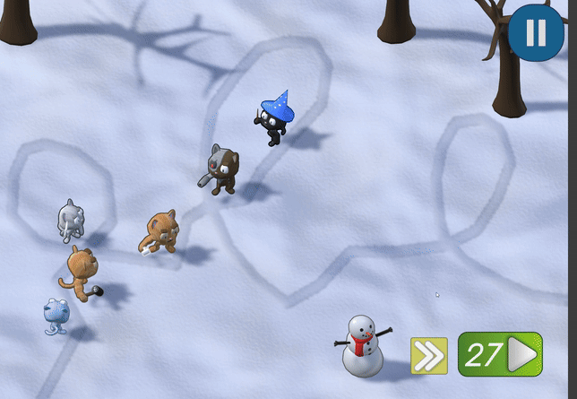

# Cats vs Fruit | Unity Game in C#
Defend against waves of fruit using a selection of cat troops. Spend money wisely to purchase troops and upgrades. If enough fruits reach the end of the path, you lose.

This project is a Tower Defense video game I created in 2023. This project developed as a Multimedia HSC final project. This repo contains the source code.
Nominated for a SHAPE 2023 award.

## Download
The game can be downloaded via Google Drive

[Google Drive Download Link](https://drive.google.com/file/d/1s8L2dMWFBGmhHhdp3ad_opAOun_5LSwG/view?usp=drive_link)

Unzip the folder and run Cats vs Fruit.exe (Windows only)

## Gameplay Features
- 5 maps in increasing difficulty.
- 5 cats unique abilities to defend against fruit.
- Each cat has 2 upgrade paths, as well as 3 minor upgrades.
- 10+ fruits with varying properties such as speed, sharp resistance and blunt resistance.

## Cats
- **Knife cat**: Throws quick knives, dealing sharp damage.
- **Hammer cat**: Throws slow hammers, dealing blunt damage, nessessary for fruits like coconut.
- **Ice cat**: Slows down incoming fruit.
- **Wizard cat**: Shoots magic, dealing sharp damage.
- **Cyborg cat**: Expensive. Rapid fires pellets. Can deal both sharp and blunt damage.

## Demo

### Acknowledgement
outline.cs was taken from the Unity asset store. The music and sound effects come from Youtube. Every other script and asset was created by me.
